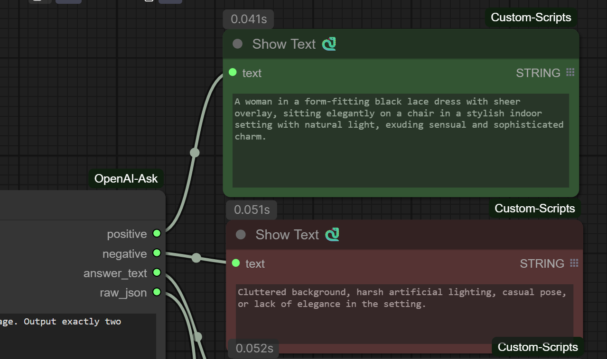
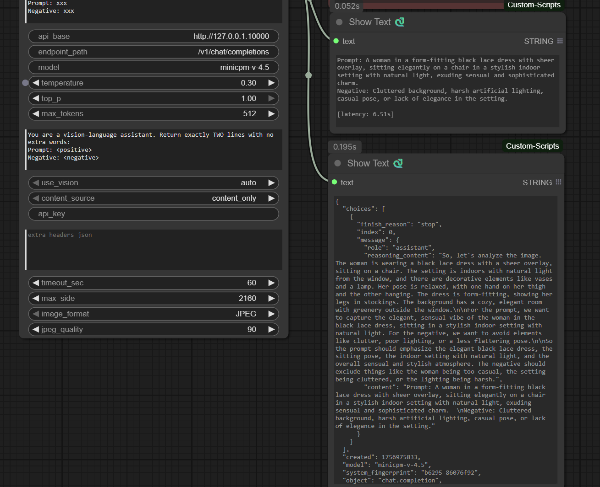

# OpenAI Ask (Vision/QA) – ComfyUI Custom Node

通过 **OpenAI 兼容 API** 调用本地/私有 LLM，实现 **看图反推提示词 + 问答**：
- 自动输出 **Prompt / Negative** 两路文案（可直接接 CLIP）
- 支持自定义 API Base（例：`http://192.168.1.242:10000`）
- 兼容 **llama.cpp / vLLM / OpenWebUI** 等 OpenAI 风格服务
- 带图片压缩（最长边、JPEG/PNG、质量）与调参（temperature/top_p/max_tokens）

<p align="center">
  
</p>


## 📸 Screenshots

<p align="center">
  
</p>

|  |  |
|---|---|
| ComfyUI 工作流与四路输出（positive / negative / answer_text / raw_json） | MiniCPM-V-4.5 GGUF 与 mmproj 文件示意 |

<p align="center">
  
</p>


## ✨ 特性
- 正/负提示词**自动拆分**（会裁掉 `Prompt:` 之前所有内容）
- 负向标签**多写法兼容**：`Negative / Negative Prompt / Avoid / Disallow / Do not / 负向 / 避免 / 不要`
- 输出 4 路：`positive`、`negative`、`answer_text`、`raw_json`
- `content_source` 开关：`content_only / auto / reasoning_only`（默认只用 `content`，更干净）
- 图片以 data:URL 传输，局域网内低开销

## 🔧 安装
```bash
# 方式一（推荐）：clone 到 ComfyUI/custom_nodes 目录
cd <your-ComfyUI>/custom_nodes
git clone https://github.com/Goldlionren/ComfyUI-OpenAI-Ask.git

# 安装依赖（确保在 ComfyUI 使用的 Python 环境）
pip install -r ComfyUI-OpenAI-Ask/requirements.txt

# 重启 ComfyUI

